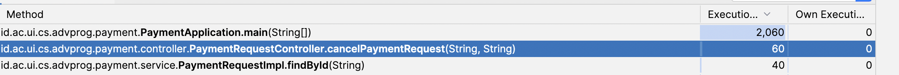

## Sebelum Profiling (cancelPaymentRequest)


Kemudian pada PaymentRequestService, saya mengubah fungsi update yang sebelumnya seperti ini
```java
@Override
public PaymentRequest update (PaymentRequest paymentRequest) {
    Optional<PaymentRequest> matchedPaymentRequestOpt = paymentRequestRepository.findById(paymentRequest.getId());
    if (! matchedPaymentRequestOpt.isPresent()) return null;
    PaymentRequest matchedPaymentRequest = matchedPaymentRequestOpt.get();
    PaymentRequestBuilder.updateFields(matchedPaymentRequest, paymentRequest);
    paymentRequestRepository.save(matchedPaymentRequest);
    return matchedPaymentRequest;
}
```

menjadi seperti ini

```java
@Override
public PaymentRequest update(PaymentRequest paymentRequest) {
    PaymentRequest matchedPaymentRequest = paymentRequestRepository.findById(paymentRequest.getId())
            .orElseThrow(() -> new EntityNotFoundException("PaymentRequest not found with id: " + paymentRequest.getId()));

    PaymentRequestBuilder.updateFields(matchedPaymentRequest, paymentRequest);
    paymentRequestRepository.save(matchedPaymentRequest);
    return matchedPaymentRequest;
}
```

Sehingga performa pada cancelPaymentRequest menjadi seperti ini

## Setelah Profiling (cancelPaymentRequest)
